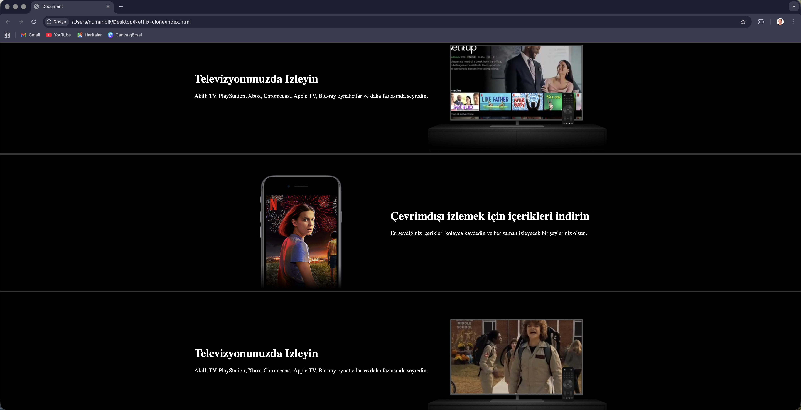

# 🎬 Netflix UI Clone

A modern and responsive Netflix clone built from scratch using HTML and CSS as part of my web development training at Udemig Software Academy.


---

## 📋 About The Project

This project is a **fully responsive** web application inspired by the real Netflix interface. The goal is to practice modern web design techniques and responsive layout principles.

⚠️ **Educational purpose only. Not affiliated with Netflix.**

---

## ✨ Features

- 🎨 Modern Netflix-inspired design
- 📱 Fully responsive (works on all devices)
- 🎯 Hover effects and smooth transitions
- 🖼️ Movie posters grid layout
- 📺 Eye-catching hero section
- 🎭 Category-based movie lists

---

## 🛠️ Technologies Used


**Technical Details:**
- HTML5 semantic tags
- CSS3 Flexbox & Grid
- CSS Custom Properties (Variables)
- Media Queries (Responsive Design)
- Hover & Transition effects

---

## 📸 Screenshots

### Homepage


### Movie Categories


### Responsive Design


---

## 🚀 Installation

```bash
# Clone the repository
git clone https://github.com/numanbalik-web/netflix-clone.git

# Navigate to directory
cd netflix-clone

# Open index.html in browser
open index.html